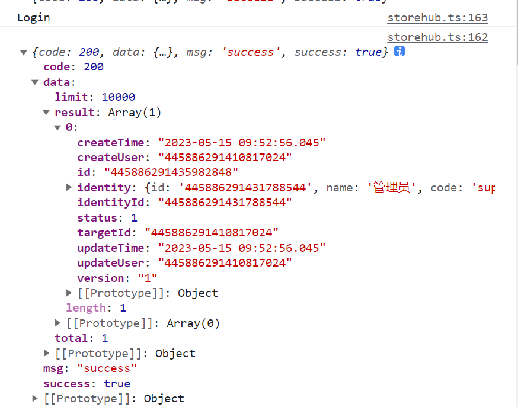

# Storehub
> 关于 SignalR.HubConnection 的官方文档（不过官方貌似没有中文版的）： https://learn.microsoft.com/zh-cn/javascript/api/@microsoft/signalr/hubconnection?view=signalr-js-latest
> 对 SignIR 还不是很熟悉，和传统的 axios 请求不太一样，之后再继续学习这一块

Storehub 功能是用来和服务器建立 SignIR 连接的
1. constructor 构造方法：构造函数，用于建立与 SignalR 服务器的连接。主要是初始化了私有对象_connection，这是用来和 SignalR 服务器的连接的对象，后面的 invoke 就是通过这一方式和服务器连接的
2. isConnected：检查是否连接
3. dispose：销毁连接
4. \_starting：初次开始连接
5. start：启动连接，如果没有启动，则调用_starting
6. restart：重新建立连接，先停止连接，之后调用start
7. onConnected：连接成功的回调函数，传入一个返回 `void` 的函数，用来在_starting 中执行
8. onDisconnected：断开连接的回调，和成功连接的回调类似，在销毁连接时执行
9. on：
	1. 接收两个参数一个是字符串（方法名），第二个是函数
	2. 这也是一个回调函数，官网上的解释是说注册一个处理程序，当调用具有指定方法名称的集线器方法时将调用该处理程序。我的理解是客户端去监听服务器，当服务器执行了第一个参数指定的方法时，就去执行后面的函数
	3. 例如：
当服务器执行了 updated 方法后，会将结果传入第二个参数所定义的函数，从而做到服务器去调用客户端的方法
```ts
this._storeHub.on('updated', (belongId, key, data) => {  
  this._updated(belongId, key, data);  
});
```
10. invoke：这是用来调用服务器的方法
	1. 接收的参数分为两个部分，第一个是调用的服务器端的方法，第二个是传入的参数
	2. 例如：在 kernelapi 中的登录方法：
```
res = await this._storeHub.invoke('Login', req);
```
我在 invoke 中打印了请求的方法和对应的请求结果：
```ts
this._connection  
  .invoke(methodName, ...args)  
  .then((res: ResultType<any>) => {  
    console.log(res); //打印请求结果 
    console.log(methodName);  //打印请求方法
	//其他的代码省略
  })
```

# anyStore
anyStore 功能主要是用来管理服务器的数据的，比如存储的文件，使用的连接方法是调用上面的 Storehub 对象
1. \_restRequest:使用 axios 请求后端，在 anyStore 的每一个方法下都会先判断一次，如果 StoreHub 没有连接上才会用 axios 请求，以下是 anyStore 涉及到的方法
2. 对物的操作：创建、加载。物是平台中抽象的一个概念，把平台中所有的对象都抽象成物
3. 对文件的操作：上传、查看
4. 对 token 的操作：更新 token 到缓存中、获取 token
5. 对对象的操作：查询、修改、删除
